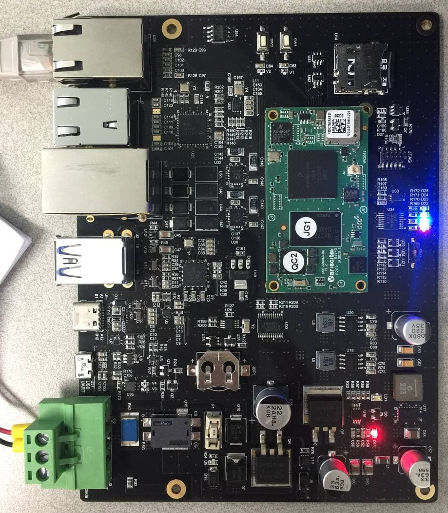

# UPO_Variscite

## Home link : 
 - https://www.variscite.com/
 - 

## wiki link : 
 - https://variwiki.com/index.php?title=DART-6UL

## Hardware : 
 
 - Power : 12V 2A
 - OS : Buster R01 (kernel 4.14.78)
 

## Linux :
 - ID/PASSWORD : root/root

## Install tool Done :
 - python3 (python3.9)

## Install tool now :
 - YOLO4 
## Install tool Yet :
 - Flask
 - nodeJS
